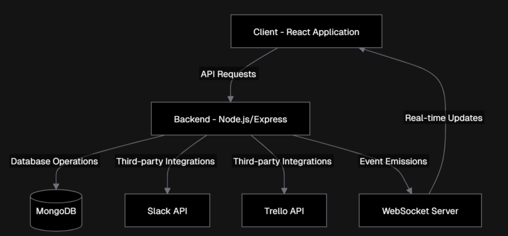

# Kanban Board Project

## 📖 Overview
The **Kanban Board** is a dynamic, responsive, and user-friendly task management tool designed to help individuals and teams visualize and optimize their workflows. With an intuitive interface and drag-and-drop functionality, it makes organizing tasks across different workflow stages (e.g., To-Do, In Progress, Done) seamless and efficient. This project leverages modern frontend technologies to deliver an interactive and visually appealing experience.

## 🚀 How This Project Helps Users
- **Enhanced Productivity**: Provides a clear view of task progress, allowing users to prioritize and manage their workloads effectively.
- **Collaboration Support**: Ideal for team-based projects by enabling task categorization and tracking.
- **Customizable Workflows**: Users can easily adapt the board to suit their specific needs, such as adding or renaming workflow stages.
- **Ease of Use**: Features drag-and-drop functionality and a responsive design, ensuring accessibility across devices.

## 💡 Use Cases
- **Project Management**: Manage tasks for software development, marketing campaigns, or any other team projects.
- **Personal Task Tracking**: Organize daily, weekly, or long-term personal tasks.
- **Educational Projects**: Track assignments, projects, and deadlines for students and educators.

## 🛠️ Technologies Used
- **Frontend Framework**: [Next.js](https://nextjs.org/) (React-based framework)
- **Programming Language**: TypeScript
- **Styling**: Tailwind CSS
- **State Management**: React hooks and local state management
- **Build Tools**: PostCSS (for CSS processing and Tailwind integration)

## 📂 Current State of the Project
- **Frontend Only**: 
  - Fully functional UI with drag-and-drop capabilities for managing tasks.
  - Swimlanes for task categorization based on workflow stages or priorities.
  - Responsive design with a clean and modern interface.
  - Theme toggle (light/dark mode).
- **No Backend**: Currently, no server-side logic, database, or third-party API integrations are implemented.

## 🛣️ Future Plans
- **Enhance UI/UX**:
  - Introduce advanced customization options (e.g., column reordering, color coding for priorities).
  - Add animations for smoother interactions.
- **Server-Side Implementation**:
  - Build a backend to handle user authentication and data storage.
  - Integrate APIs for real-time collaboration.
- **Third-Party API Integration**:
  - Connect with tools like Slack and Trello for notifications and task synchronization.
- **User Authentication**:
  - Implement secure user login and signup methods.
  - Support OAuth integrations (e.g., Google, GitHub).
- **Database Integration**:
  - Store user data, task details, and board configurations in a database (e.g., PostgreSQL, MongoDB, or Firebase).

